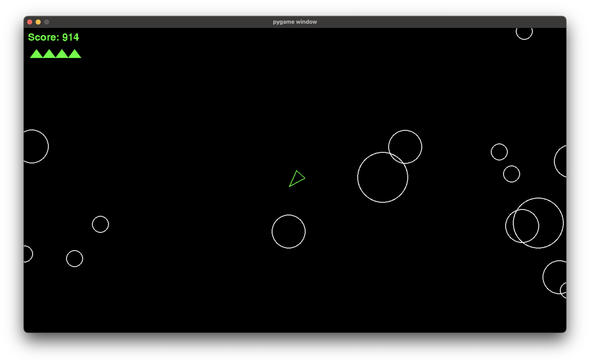

# Asteriods
My version of the populer asteroids game. 👌🏽

## Description

Can't believe I have to explain Asteroids, but yeah, it's one of the first video games made. The Idea is pretty simple, you are in a spaceship armed with a canon, with only one job, shooting asteroids. You stay in the game by not getting hit by one.

## Getting Started

### Dependancies

Ensure you have [Python3](https://www.python.org/downloads/) installed.

Confirm this by running:
- On macOS/Linux: `which python3`
- On Windows: `python --version` or `py --version`

### Git clone

- `git clone https://github.com/see-why/Asteriods.git`
-  then `cd` into the repo folder
- run `pip install -r requirements.txt` to install other dependancies.
- to isolate or prevent version issues you can use `venv`
    - `python3 -m venv venv`
    - `source venv/bin/activate`

### Running program

- To start run `python3 main.py`
- Press `A` to go left, `W` up, `D` right and `Z` down
- Press `K` to kill!!!
- Press `Spacebar` to pause and resume.

## [Download and play locaclly](https://see-why.itch.io/asteroids)

## Author
👤 **Cyril Iyadi**

- GitHub: [@see-why](https://github.com/see-why)
- LinkedIn: [C.Iyadi](https://www.linkedin.com/in/cyril-iyadi/)

## 🤝 Contributing

Contributions, issues, and feature requests are welcome!

Feel free to check the [issues page](../../issues/).

## Show your support

Give a ⭐️ if you like this project!

## 📝 License
- This project is [MIT](./LICENSE) licensed.
